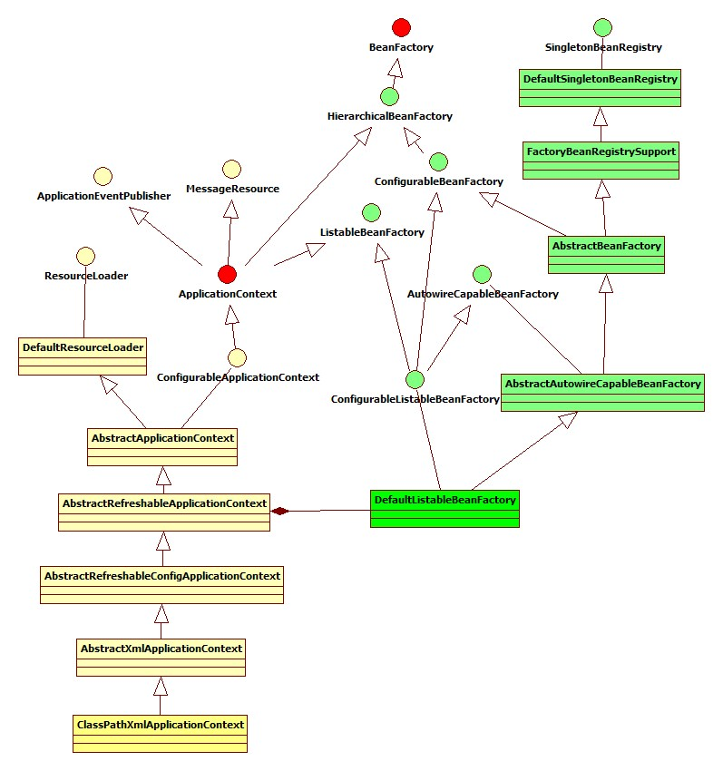

[Spring]

- [Spring-ioc]
  1. IoC的官方解读

     > 所谓 IoC ，就是由 Spring IoC 容器来负责对象的生命周期和对象之间的关系

  2. IoC和DI的两种解读

     > **控制反转IoC(Inversion of Control)是说创建对象的控制权进行转移，以前创建对象的主动权和创建时机是由自己把控的，而现在这种权力转移到第三方**
     >
     > **对于某个具体的对象而言，以前是它控制其他对象，现在是所有对象都被spring控制，所以这叫控制反转。**
     >
     > **因为由容器帮我们查找及注入依赖对象，对象只是被动的接受依赖对象，所以是反转；哪些方面反转了？依赖对象的获取被反转了。**
     >
     > **IoC和DI**由什么**关系**呢？其实它们是同一个概念的不同角度描述，由于控制反转概念比较含糊（可能只是理解为容器控制对象这一个层面，很难让人想到谁来维护对象关系），所以2004年大师级人物Martin Fowler又给出了一个新的名字：“依赖注入”，相对IoC 而言，**"依赖注入"明确描述了"被注入对象依赖IoC容器配置依赖对象"。**

  3. 什么叫Bean？

     > BeanDefinition 就是我们所说的 Spring 的 Bean，我们自己定义的各个 Bean 其实会转换成一个个 BeanDefinition 存在于 Spring 的 BeanFactory 中。
     >
     > 所以，如果有人问你 Bean 是什么的时候，你要知道 Bean 在代码层面上是 BeanDefinition 的实例。
     >
     > BeanDefinition 中保存了我们的 Bean 信息，比如这个 Bean 指向的是哪个类、是否是单例的、是否懒加载、这个 Bean 依赖了哪些 Bean 等等。

  4. BeanFactory和ApplicationContext的区别和联系?

     > BeanFactory 粗暴简单，可以理解为就是个 HashMap，Key 是 BeanName，Value 是 Bean 实例。通常只提供注册（put），获取（get）这两个功能。我们可以称之为 “低级容器”。

     > ApplicationContext 可以称之为 “高级容器”。因为他比 BeanFactory 多了更多的功能。他继承了多个接口。因此具备了更多的功能。例如资源的获取，支持多种消息（例如 JSP tag 的支持），对 BeanFactory 多了工具级别的支持等待。所以你看他的名字，已经不是 BeanFactory 之类的工厂了，而是 “应用上下文”， 代表着整个大容器的所有功能。

  5. BeanFactory类图关系和ApplicationContext的类图关系?

     先看下图（摘自:[http://singleant.iteye.com/blog/1177358）](http://singleant.iteye.com/blog/1177358%EF%BC%89)

     

  6. Spring是怎么加载Bean到容器的，其中的依赖关系是怎么弄的?

  7. 单例Bean的循环依赖呢？
     
     三级缓存：
     
     第一级为 singletonObjects
     第二级为 earlySingletonObjects
     第三级为 singletonFactories
